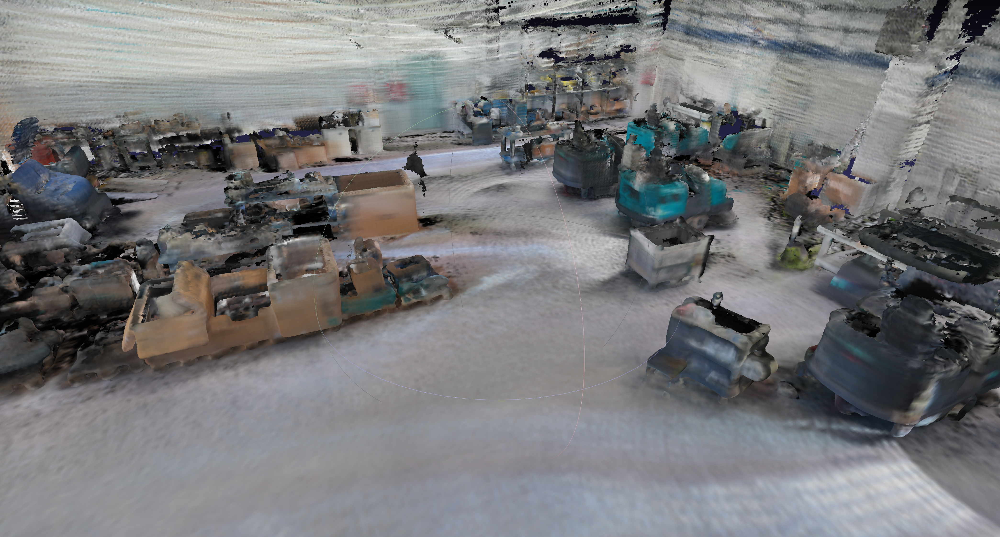

# Finer-detail RGB mesh via TSDF fusion



This is a second, independent reconstruction of the same environment as
[`../coverage1_edited/`](../coverage1_edited/), built to get past that
pipeline's main limitation: GLIM's saved map only keeps a downsampled point
cloud (149,813 points, ~6.35 cm median spacing), so no meshing algorithm run
on it can recover detail finer than that spacing.

Instead of reading GLIM's saved map, this pipeline goes back to the original
ROS 2 bag and re-derives everything from the **raw sensor stream**: every
`/ouster/points` scan (full ~60k points/revolution instead of GLIM's
decimated keyframe map) plus the `/rgb/image_raw` camera feed, fused with
GLIM's own solved trajectory. It also switches reconstruction algorithm, from
screened Poisson (which fits an implicit function to oriented points and can
extrapolate across gaps) to **TSDF volumetric fusion** (which only ever
records what was actually observed along real sensor rays), and adds
photographic RGB colour where the camera saw a point, instead of grayscale
LiDAR intensity only. The one deliberate exception is the floor: since the
map is meant for simulation, the measured floor is not fused but replaced by
a smooth synthetic floor surface lying exactly on the fitted floor model,
coloured from the floor points (step 4).

Two steps, both taking the bag name:

1. `build_finer_map.py <name>` fuses the raw bag into
   `outputs/<name>/<name>_finer_mesh.ply` (binary PLY with per-vertex RGB),
   estimating the floor on the way, discarding below-floor returns and
   replacing the measured floor with a smooth, coloured synthetic floor.
2. `refine_mesh.py <name>` post-processes that mesh into
   `outputs/<name>/<name>_refined_mesh.ply` (**recommended output**): small
   floating pieces removed, smoothed, small holes filled and decimated to a
   size a viewer opens comfortably, with the synthetic floor added back unchanged.

See the `finer_map_report.json` / `refine_report.json` next to each mesh for
the exact figures behind it. The build writes a single PLY (fused objects +
synthetic floor); `refine_mesh.py` also exports OBJ and STL, which have no
portable vertex-colour support, so use the PLY for the coloured result. Each output folder's `preview.png` is a static top-down
scatter render (`make_preview.py`) for a quick look without a mesh viewer.
See "Visualizing the output" below for how to view either.

## Why this needed raw data, not GLIM's saved map

| | `coverage1_edited` (Poisson) | `finer_mapping` (TSDF, this pipeline) |
|---|---|---|
| Point source | GLIM's saved, decimated submap points | Raw `/ouster/points` from the bag |
| Points used | 149,813 | tens of millions (every valid raw return) |
| Median point spacing | ~6.35 cm | limited by the sensor's own angular resolution, well under 6.35 cm at typical room range |
| Colour | LiDAR intensity (grayscale) only | Camera RGB where visible, intensity grayscale fallback |
| Reconstruction | Screened Poisson (PCL) | TSDF volumetric fusion (custom, this pipeline) |
| Extrapolation behaviour | Can bridge gaps with a plausible-looking but unmeasured surface (trimmed afterwards to 20 cm of source data) | Only ever produces surface within one voxel of somewhere a ray actually terminated, except the floor, which is a modelled plane filling the whole floor outline |

GLIM's own map storage is intentionally decimated for real-time SLAM, so
`coverage1_edited`'s 6.35 cm spacing is a hard ceiling on Poisson's output no
matter how the mesh is post-processed. Rebuilding from the raw bag removes
that ceiling; the sensor's own angular resolution becomes the limit instead.

## Source data

- **Bag:** `/home/autosweep/autosweep/dataset22jul/coverage1_lipede/` (the pipeline
  always plays the `_lipede` recording; it has the same start time and message
  count as the plain `coverage1/coverage1.db3`)
  (identified as the source for `coverage1_edited` by matching epoch
  timestamps: the bag starts at 1784717473.91s and `traj_lidar.txt`'s samples
  fall inside the bag's [start, start+311s] window).
- **Trajectory:** `coverage1_edited/traj_lidar.txt` — GLIM's global-mapping
  (loop-closure-corrected) LiDAR trajectory, TUM format (`t x y z qx qy qz
  qw`), 2,466 poses at ~100 ms spacing covering a continuous 300.5 s span
  with no gap over 0.5 s.
- **Calibration:** `coverage1_edited/config/config_sensors.json` —
  `T_lidar_camera` extrinsic, camera intrinsics/distortion
  (`rational_polynomial`, 8 coefficients, OpenCV-compatible order). Verified
  against the bag's own `/tf_static` (`T_lidar_imu` matches the recorded
  `os_sensor -> os_imu` transform exactly) and against GLIM's own
  `image_frame: rgb_camera_link` convention.
- **Sensor:** Ouster LiDAR at `/ouster/points` (organized `PointCloud2`,
  64 rings x 1024 columns/revolution, ~10 Hz, fields include `x y z
  intensity t ring range`) and an RGB camera at `/rgb/image_raw`
  (2048x1536, `bgra8`, ~9.3 Hz).

Only points whose timestamp falls inside the trajectory's covered time range
are used — the raw bag starts about 10.6 s before GLIM's first solved pose
(before enough data had accumulated to initialize global mapping), and those
early scans are skipped rather than extrapolated.

## Pipeline (`build_finer_map.py`)

Passes over the bag: (1) cache camera frames, (2) estimate an intensity
normalisation range, (3) estimate the floor, (4) fuse every scan.

### 1. Trajectory interpolation (`src/trajectory.py`)

`traj_lidar.txt` gives `T_world_lidar` (world <- LiDAR/`os_sensor`) at ~100 ms
steps. Any in-between pose is obtained by linearly interpolating position and
spherically interpolating (slerp) orientation between the two bracketing
samples — accurate here because 100 ms is already fine compared to how fast
the platform moves.

### 2. Per-column deskewing, not per-scan (`src/ouster_scan.py`, `build_finer_map.py`)

A LiDAR "scan" is a full 360 deg revolution, so its first and last points
are up to ~100 ms apart — assigning every point in a scan the same pose
(what GLIM's own saved keyframe poses effectively give you) smears moving-
platform motion into the geometry. This pipeline instead reads the Ouster
`t` field (a per-point capture-time offset within the scan) to interpolate a
*separate* trajectory pose for every column. Since Ouster fires all 64 beams
in a column simultaneously (confirmed directly against the raw bag: the `t`
field is identical across all rows for a fixed column), this only costs one
trajectory interpolation per column (1024) rather than per point (~65,000).

### 3. Organized-cloud preprocessing (`src/ouster_scan.py`)

Ouster's `PointCloud2` is published *organized*: message height = 64 equals
the ring count, and row index equals the `ring` field exactly (also checked
directly). That structure is used for two things a plain unordered point
cloud can't do cheaply:

- **Edge/mixed-pixel filtering** — at a depth discontinuity (e.g. a doorframe
  in front of a far wall), some LiDAR returns fall roughly halfway between
  the near and far surface and don't correspond to anything real. Comparing
  each point's range to its immediate azimuth neighbours *within the same
  ring* (an O(1) array lookup thanks to the organized layout, no KNN search
  needed) flags and drops these before they corrupt the TSDF.
- **Incidence-angle weighting** — a cheap per-point normal from
  finite-differencing neighbouring beams (row and column direction) gives an
  estimate of how face-on each return was. Grazing-angle returns (surface
  nearly parallel to the ray) are noisier and get down-weighted in the TSDF
  fusion (clipped to [0.2, 1.0], never dropped outright).

Invalid returns (`range == 0`, arriving as NaN x/y/z from the ROS driver)
are always excluded.

**Per-ring min-range for the bottom rings.** Ring index correlates directly
with beam elevation: sampling `coverage1_lipede` every 15th scan, per-ring
median range falls monotonically from ~9.9 m at ring 0 (near-horizontal) to
~1.75 m at ring 63 (steepest downward) — expected, since the steepest beams
hit the floor closest to the sensor. Within rings 60-63 specifically, a
narrow band of ~120 `(ring, column)` cells sits noticeably closer than even
that ring's own floor baseline (e.g. ring 63's floor median is 1.75 m, but a
cluster there sits at 0.35-0.55 m) and recurs at nearly the same azimuths in
80-90%+ of scans - almost certainly the robot's own chassis/wheel/brush
rather than mapped environment, since real scene geometry wouldn't stay
that close at a fixed bearing for the entire trajectory. The global
`--min-range` (0.5 m) sits *inside* that cluster's range, so part of it
(0.5-0.66 m) survived filtering and got fused every scan - and because a
near-constant LiDAR-local offset deskews to world coordinates as
`R @ small_offset + t`, it stayed close to the sensor position `t` itself,
tracing something close to the trajectory shape in the output mesh.
`--bottom-rings`/`--bottom-ring-min-range` raises the cutoff to 0.8 m for
just the last 4 rings (clearing the observed cluster with margin) rather
than raising `--min-range` globally, which would also discard legitimate
close-up detail the upper rings pick up near walls and furniture.

### 4. Floor estimation, below-floor rejection and the synthetic floor (`src/floor.py`, `src/floor_slab.py`)

Points below the floor are not real geometry: they are mostly LiDAR
multipath returns (the beam bounces off a glossy floor and the sensor records
a point "inside" it) plus noise. In the earlier coverage1 build
(`outputs/coverage1_first/`), 13.6% of the mesh vertices sat more than
5 cm under the floor and 5.4% more than 30 cm under it; with this filter
(before the floor was replaced by a synthetic one) that dropped to 0.1% and 0%. They are removed *before* fusion rather than cut
out of the mesh afterwards, so they never create surfaces or blend into
colours in the first place.

The floor cannot be a fixed world-z cutoff: GLIM's world frame is not
gravity-aligned (coverage1's floor is tilted ~2.0 deg in it; the LiDAR's own
z-axis in world coordinates is tilted the same way), and over the whole map
the floor also drifts a few cm away from any one plane. So the model is a
global plane plus a coarse per-cell height correction, estimated from every
`--floor-sample-stride`-th scan:

1. **Candidates**: points whose organized-cloud normal is within 15 deg of the
   sensor's up axis and that lie within 4 m (horizontally) of the sensor that
   measured them. The robot drives on the floor, so near the sensor the
   dominant horizontal surface *is* the floor.
2. **Mounting height**: a histogram of candidate heights relative to their own
   sensor position peaks at minus the sensor's mounting height (0.605 m on
   coverage1); only candidates within 15 cm of the peak are kept. Being
   relative to the sensor at capture time, this step is immune to trajectory
   drift in z.
3. **Global plane, RANSAC then SVD**: SVD is a least-squares fit, so on its
   own the below-floor outliers this is meant to remove would drag the plane
   down. RANSAC (normals constrained to within 10 deg of the sensor's up axis)
   finds the inlier set, then SVD on the inliers alone gives the precise
   plane (coverage1: 2.4 cm inlier residual std over the whole map, which the
   per-cell correction then takes up; floor vertices end up a median 0.8 cm
   from the model).
4. **Per-cell correction**: the median residual of near-plane candidates in
   each `--floor-cell-size` (1 m) cell, filled from the nearest measured cell
   where there were none, median-filtered and clamped to +/-8 cm, then
   bilinearly interpolated so there are no steps at cell edges.

During fusion, points more than `--floor-margin` (5 cm) below that local floor
are dropped; `--ceiling-height` optionally drops points more than that far
above it too. The model is saved as `floor_model.npz` next to the mesh (reused
by `refine_mesh.py`, or by another build via `--floor-model`), and summarised
in `finer_map_report.json`.

**The floor is not fused; a synthetic floor replaces it** (`src/floor_slab.py`).
The map is meant for simulation, where the floor should be a clean, smooth
surface, and a fused floor is never quite one. It also keeps anything left
on it (the feet of people who walked by) joined to it, so `refine_mesh.py`'s
small-component filter cannot remove it. So during fusion a point within
`--floor-band` (5 cm) of the local floor whose normal is within
`--floor-normal-angle` (30 deg) of the floor normal (or that has no valid
normal) counts as floor and is **not integrated**. Points near the floor
that face sideways (the bases of walls, furniture legs) are fused as usual,
so objects still reach down to the floor. Floor points are still used for
two things:

- **Carving.** Their rays sweep the space just above the floor, and since
  there is no fused floor to protect, a ray that hit the floor carves right
  down to one voxel short of it (see step 6), which clears what people left
  behind close to the floor.
- **Colour.** Their colour (RGB-first, same weighting as step 5) is
  accumulated into a 2-D grid of voxel-sized cells in world xy.

After fusion, the cells that saw floor, closed over gaps up to
`--floor-fill-radius` (15 cm), with enclosed holes (under furniture, unseen
patches) filled and only the largest connected region kept, give the map's
floor outline. Over it the build adds the synthetic floor, with a vertex on
every voxel-cell corner and per-vertex colour from the grid (cells without
floor colour of their own take the nearest one's). By default
(`--floor-slab-top model`) it is a **single upward-facing surface lying
exactly on the floor model**: the global plane plus the per-cell correction,
which is median-filtered and bilinearly interpolated, so the surface is
smooth with no steps. It is not one perfect plane (on coverage1 it stays
within -3 to +7 cm of the global plane, from GLIM drift or real
unevenness), but walls and objects, which were fused down to the real local
floor, meet it with no gaps and without sinking into it, and there are no
extra layers or margins.

Two alternatives make it a **closed flat slab** (top and bottom faces
parallel to the global plane, side walls along the outline):
`--floor-slab-top highest` puts the top at the measured floor's highest point
(+7.2 cm on coverage1), so every wall and object base ends inside the slab,
at the cost of objects on the lowest parts of the floor looking up to about
10 cm shorter; `--floor-slab-top plane` puts it on the global plane (leaving
gaps of up to 7 cm under walls where the floor is higher). The bottom face
is at the measured floor's lowest point minus `--floor-margin`, or
`--floor-slab-thickness` below the top. A slab shows as two parallel floor
layers in a viewer (its top and bottom faces).

The synthetic floor is merged with the fused geometry into the build's only
mesh output, `<name>_finer_mesh.ply`. Nothing is cut where the two overlap:
a few fused leftovers near the floor (and, with a flat slab, wall and object
bases) can lie slightly below the floor surface, hidden under it. That is
harmless for rendering, LiDAR/depth simulation and static collision, but the
merged mesh is not one watertight solid.

**Output frame: z = 0 on the floor.** The output mesh is shifted along z only
(no rotation), so the synthetic floor's top surface is exactly at z = 0 under
the GLIM origin (the robot's start pose); x and y are GLIM's. On coverage1
the shift is +0.5002 m with the default floor surface (+0.4375 m with
`--floor-slab-top highest`). Because the floor is tilted ~2 deg in GLIM's
frame and the mesh is not rotated, the floor is only at z = 0 there: across
the map it lies up to about +/-0.4 m from z = 0. The shift is recorded as
`output_z_offset_m` in `finer_map_report.json` (add it to a GLIM z, e.g. of
the trajectory, to get output coordinates); everything else in the report,
and `floor_model.npz`, stays in GLIM's frame, since `--floor-model` is reused
for fusion. `refine_mesh.py` reads the offset and shifts the floor model to
match the mesh.

### 5. Colourisation, RGB-first (`src/colorizer.py`)

`cache_frames()` walks the bag once and saves every `/rgb/image_raw` frame to
disk as JPEG plus a timestamp index (`cache/<name>/frames/`, `cache/<name>/timestamps.npy`)
so the fusion pass never holds more than a handful of full-resolution frames
in memory.

For each scan column, the camera frame closest in time (within
`--max-image-dt`, default 90 ms) is looked up. Deskewed world-frame points
are projected into that frame using the calibrated extrinsic
(`T_lidar_camera`) evaluated at *the image's own capture time* (not the
LiDAR column's time — the camera moved between those two instants too) and
the rational-polynomial distortion model, via `cv2.projectPoints` directly
against the raw (not undistorted) image. A per-scan z-buffer keeps only the
nearest-camera-depth point per output pixel — since the LiDAR and camera are
rigidly co-mounted, a single scan's own points already share close to the
matched image's viewpoint, so this catches ordinary self-occlusion (e.g. a
near wall vs. the corridor behind it) without needing a full-scene renderer.
It will *not* catch occlusion from geometry outside the current scan (e.g. a
thin object mapped in an earlier scan that no longer occludes now) — a known,
documented limitation, not a silent one.

Points with no camera frame close enough in time, that land outside the
image, are behind the camera, or lose the z-buffer test fall back to a
percentile-normalised (1st/99th) grayscale of LiDAR intensity, using the same
convention as `coverage1_edited/color_intensity.py`. In the run that produced
the current output, 17.3% of fused points were coloured from RGB (see
`points_coloured_from_rgb_pct` in `outputs/<name>/finer_map_report.json` for
whatever the most recent run actually measured) — the camera has a much
narrower field of view than the LiDAR's full 360 deg sweep, so most points
simply never appear in any frame; this is expected, not a bug.

**RGB outweighs intensity in the voxel colour.** A voxel is usually hit by
many points, some coloured from the camera and some only from intensity.
Averaged with equal weight, the grayscale samples wash the photographic colour
out (in the previous build only 36% of vertices were pure gray, yet many of
the rest were RGB diluted with gray, not pure RGB). So colour has its own weight in the
TSDF, separate from the geometric one, and an intensity sample counts
`--intensity-color-weight` (0.02) times an RGB sample: any voxel the camera
saw at least a few times ends up close to pure RGB, and voxels the camera
never saw stay intensity gray as before. Setting it to 1.0 restores the old
equal blend. The geometry is unaffected.

### 6. TSDF volumetric fusion (`src/tsdf_volume.py`)

Classic TSDF fusion (KinectFusion, Open3D's `ScalableTSDFVolume`) integrates
a *pinhole depth image* every frame — that doesn't apply here since a
spinning LiDAR scan is a spherical sweep, not a pinhole image. This
implements the point-cloud generalisation instead (the same idea tools like
VDBFusion are built around, reimplemented here directly in NumPy since no
prebuilt OpenVDB-based Python package was installable in this environment):
for every point `p` measured from sensor origin `o`, the ray direction
`d = (p - o) / |p - o|` defines a 1-D signed-distance axis, and a short band
of voxels around `p` (+/- `truncation_distance`, default 4 voxels) is updated
with

```
sdf(voxel) = dot(p - voxel_center, d)
```

— positive between the sensor and the surface (free space), negative beyond
it (occluded) — combined across scans with a running incidence-weighted
average. This only touches voxels near an actual measured surface (a dense
NumPy grid stays tractable at room scale without an octree/hash structure),
and, unlike Poisson, never invents surface far from anywhere a ray actually
terminated (the synthetic floor of step 4, added after fusion, is the one
deliberate exception).

**Free-space carving.** The band update above only ever records surfaces, so
anything that was there for a while and then left (a person walking past, a
door that was opened) stays in the map as a ghost: no later measurement
contradicts it. Every scan, one ray in `--carve-ray-stride` (8) is also walked
from the sensor up to one truncation distance + one voxel short of its
endpoint, and every *already-observed* voxel it crossed gets one free-space
observation (sdf = +truncation, weight `--carve-weight`, 0.2) per scan. A
surface seen a few times and then repeatedly seen *through* fades away;
static geometry, observed thousands of times, barely moves. Carving never
touches voxels nothing has observed yet, so it cannot create surface. Rays
that ended on the floor (not fused, see step 4) are walked to one voxel
short of it instead of one truncation distance + one voxel, so carving
reaches all the way down to the floor. (When the floor was still fused,
carving had to skip the bottom 10 cm, where near-grazing rays would slowly
erode it; `--carve-floor-clearance` still exists but now defaults to 0.)
Colour has its own weight sum (see step 5), so carving never changes it. On coverage1
this removed ~117k vertices, almost all of them the trails people left
walking through the room during the recording (0.3-1.5 m high, long curved
bands crossing the robot's route), at the cost of ~40% more fusion time
(12 min instead of ~8.5 for the full bag).

**Mesh extraction.** The zero level set is extracted with marching cubes
(`scikit-image`) over cubes whose **8 corners all** have more than
`--min-weight` accumulated weight. Unobserved voxels hold a +truncation
placeholder, and any cube that mixes them with real (often negative,
behind-surface) values produces a fake zero crossing. Earlier builds
evaluated those boundary cubes, which gave a phantom second floor about 7 cm
under the real one and "curtains" along every observation boundary.
(skimage tests its `mask` at a cube's *upper* corner, which is why the
all-corners mask is built one voxel shifted.) Vertices are placed at voxel
*centres*, the same convention integration uses; earlier builds were offset
by half a voxel (-1.5 cm on every axis). On a synthetic flat floor the
extracted surface now lands within 0.1 cm of the true plane. Together these
cut the coverage1 mesh from 5.6M to 2.1M vertices without losing measured
surface: 91% of the earlier build's above-floor vertices are within 15 cm of
the new mesh (the 7-13 cm band is the removed phantom layer). The rest were
curtains along observation edges, most of them high up under the roof where
coverage is sparse. (With carving on top, and before the floor was replaced
by a synthetic one, the build was 1.94M vertices.) If thin, sparsely seen structures (e.g. roof beams) matter,
lowering `--min-weight` keeps more of them, at the cost of noisier surface.
Per-vertex colour
is sampled from the nearest voxel's accumulated colour average, and the
mesh is cleaned and given consistent normals with VTK before export
(`vtkCleanPolyData` + `vtkPolyDataNormals`, matching the finishing step
`coverage1_edited/finish_mesh.py` uses).

## Parameters (`build_finer_map.py` CLI)

| Flag | Default | Meaning |
|---|---|---|
| `<name>` (positional) | required | Bag name: reads the bag from `<datasets-root>/<name><bag-suffix>` and the GLIM map/odometry from `<maps-root>/<name>` |
| `--bag-suffix` | `_lipede` | Appended to `<name>` for the bag directory only (`""` reads the plain recording) |
| `--datasets-root` / `--maps-root` | `~/autosweep/dataset22jul` / `~/autosweep/glim_maps` | Where the bags and GLIM maps live |
| `--bag` / `--map-dir` | derived from `<name>` | Override either input directory separately |
| `--points-topic` / `--image-topic` | `/ouster/points` / `/rgb/image_raw` | Sensor topics (Dome bags record `/ousterDome/points`) |
| `--out-dir` / `--cache-dir` | `outputs/<name>` / `cache/<name>` | Where results and the camera frame cache go |
| `--voxel-size` | 0.03 m | TSDF voxel edge length — the main detail/memory/runtime dial |
| `--truncation` | 4 x voxel size | Half-width of the band around each surface point that gets updated |
| `--min-range` / `--max-range` | 0.5 / 15.0 m | Discard returns outside this range |
| `--bottom-rings` / `--bottom-ring-min-range` | 4 / 0.8 m | Raise the min-range for the steepest-downward-looking rings only (see below) |
| `--edge-jump` | 0.3 m | Within-ring range-discontinuity threshold for edge/mixed-pixel filtering |
| `--padding` | 6.0 m | Metres of TSDF volume padding around the trajectory bounding box (all faces except the bottom when a floor model exists) |
| `--padding-below-floor` | 0.5 m | Bottom face of the volume: this far below the lowest point of the floor model (nothing is ever observed under the floor) |
| `--max-image-dt` | 0.09 s | Max time gap between a scan column and the camera frame used to colour it |
| `--intensity-color-weight` | 0.02 | Weight of an intensity-grayscale sample in a voxel's colour average, relative to an RGB sample (1.0 = equal blend) |
| `--min-weight` | 1.5 | Minimum accumulated TSDF weight for a voxel to count as observed |
| `--floor-margin` | 0.05 m | Drop points more than this far below the local floor |
| `--ceiling-height` | off | Drop points more than this far above the floor |
| `--floor-cell-size` | 1.0 m | Cell size of the floor model's per-cell height correction |
| `--floor-sample-stride` | 10 | Estimate the floor from every N-th scan |
| `--floor-model` | none | Reuse a `floor_model.npz` instead of estimating the floor again |
| `--no-floor-filter` | off | Skip floor estimation and keep below-floor points; the floor is then fused like everything else and no slab is made |
| `--floor-band` | 0.05 m | Points up to this far above the local floor and facing up are floor: not fused, only used to colour the synthetic floor |
| `--floor-normal-angle` | 30 deg | Max angle between a floor point's normal and the floor normal |
| `--floor-slab-top` | `model` | Synthetic floor: a single surface exactly on the floor model (`model`), or a closed flat slab with its top at the measured floor's highest point (`highest`) or on the global plane (`plane`) |
| `--floor-slab-thickness` | auto | Flat slab only: thickness; default reaches the measured floor's lowest point minus `--floor-margin` |
| `--floor-fill-radius` | 0.15 m | Gaps in the observed floor closed before filling enclosed holes |
| `--carve-ray-stride` | 8 | Free-space carving uses one ray in N per scan; 0 disables carving |
| `--carve-weight` | 0.2 | Weight of one free-space observation per voxel per scan |
| `--carve-floor-clearance` | 0 m | Never carve voxels this close to the floor (not needed now that the floor is not fused) |
| `--limit-scans` | none | Debug: process only the first N scans |
| `--skip-frame-cache` | off | Reuse an existing `cache/<name>/` frame dump instead of re-extracting it |

**Voxel size is a memory trade-off**, since the TSDF grid is dense (no
octree): coverage1's bounding box needs 975 x 932 x 269 = ~244M voxels at
3 cm, 6 float32 values each (weight, weighted sdf, colour weight, weighted
RGB) -> ~5.9 GB of RAM. The box is the trajectory's bounding box padded by
`--padding` (6 m) on every side except the bottom, which sits only
`--padding-below-floor` (0.5 m) under the lowest point of the floor model:
nothing is ever observed under the floor, and padding it the full 6 m made
the grid 422 voxels tall (383M voxels, ~7.7 GB) for no extra surface. The box's
lower corner is snapped to a multiple of the voxel size, so voxels sit at the
same world positions whatever the padding and two runs that differ only in
bounds give the same mesh. Halving the voxel size multiplies the voxel
count (and memory) by roughly 8x — see `finer_map_report.json`'s
`grid_dims`/`total_voxels` for the actual numbers from this run before
lowering `--voxel-size` further.

## Refining the mesh (`refine_mesh.py`)

Everything that only needs the finished mesh lives in a separate script, so
it can be tuned in seconds to minutes without re-running fusion:

```bash
python3 refine_mesh.py coverage1
```

It reads `outputs/<name>/<name>_finer_mesh.ply` and `floor_model.npz`, and
writes `outputs/<name>/<name>_refined_mesh.{ply,obj,stl}` plus
`refine_report.json`. The synthetic floor is first found in the input (the
connected piece whose vertices all lie exactly on the floor model, or on two
planes parallel to it for a flat slab, which fused geometry never does) and
set aside, so the steps
below only ever touch the fused geometry; it is added back unchanged at the
end (`--refine-floor-slab` processes it like the rest instead). The steps,
in order (set a parameter to 0 to skip that step):

| Step | Flag (default) | What it does |
|---|---|---|
| Clip | `--clip-margin` (0.05 m), `--ceiling-height` (off) | Drops triangles with a vertex below the floor (or above the ceiling). Mostly a safety net, since the build already filters before fusion. |
| Small pieces | `--min-component` (500 triangles) | Removes disconnected fragments from noise or surfaces glimpsed through glass |
| Smoothing | `--smooth-iterations` (15), `--smooth-passband` (0.1) | Windowed-sinc (Taubin-style) smoothing: removes marching cubes' voxel-scale stair-steps without the shrinkage of plain Laplacian smoothing |
| Floor flattening | `--flatten-tolerance` (0.03 m), `--flatten-max-angle` (25 deg) | Projects floor vertices (within tolerance of the floor, normal close to the floor normal) onto the floor model. Skipped when the input has a synthetic floor: there is no fused floor left to flatten |
| Hole filling | `--fill-holes` (0.3 m) | Closes holes up to about that size in walls and objects |
| Decimation | `--decimate` (0.5) | Quadric decimation (geometry only) removing that fraction of triangles, mostly on flat areas; each remaining vertex takes the colour of the nearest pre-decimation vertex |
| Synthetic floor | `--refine-floor-slab` (off) | Adds the synthetic floor set aside at the start back, unchanged |

If `floor_model.npz` is missing (for example a mesh built before floor
estimation existed), the floor is estimated from the mesh itself, from
upward-facing vertices near the GLIM trajectory (`--map-dir`, default
`<maps-root>/<name>`). `--input` refines any other mesh:

```bash
python3 refine_mesh.py coverage1 --input outputs/coverage1_first/coverage1_finer_mesh.ply \
    --out-dir outputs/coverage1_first
```

## Running it

```bash
cd /home/autosweep/finer_mapping
source .venv/bin/activate      # created with: python3 -m venv .venv --system-site-packages
python3 build_finer_map.py coverage1      # or ./run.sh coverage1
python3 refine_mesh.py coverage1
```

The single argument is the bag name. The bag played is always the `_lipede`
recording of that name, while the GLIM map, cache and outputs use the plain
name: `coverage1` reads `/home/autosweep/autosweep/dataset22jul/coverage1_lipede`
(rosbag2) and `/home/autosweep/autosweep/glim_maps/coverage1` (`traj_lidar.txt`
+ `config/config_sensors.json`), and writes to `outputs/coverage1/`. The script
stops early with a list of any missing inputs. `--bag-suffix ""` reads the
plain recording instead, and `--bag`/`--map-dir` override either path
entirely.

`.venv` was created with `--system-site-packages` so it inherits this
machine's ROS 2 Jazzy install (`rclpy`, `rosbag2_py`, `sensor_msgs_py`,
`cv_bridge`) and system OpenCV/VTK, adding only `scikit-image` on top (see
`requirements.txt`). It is *not* portable to another machine's Python/ROS
install; recreate it there instead of copying it:

```bash
python3 -m venv .venv --system-site-packages
source .venv/bin/activate
pip install -r requirements.txt
```

`cache/<name>/` (camera frame JPEGs + timestamps, ~900 MB per bag) is produced by the first
run's pass 1 and reused on subsequent runs via `--skip-frame-cache`; delete
it to force re-extraction (e.g. after pointing `--bag` at different data for the same name).

## Visualizing the output

**Full interactive mesh (recommended):** MeshLab is installed on this
machine and reads the PLY's per-vertex RGB directly.

```bash
meshlab outputs/coverage1/coverage1_finer_mesh.ply
```

`meshlabserver` is also available for headless/scripted use (e.g. batch
screenshots or format conversion via a MeshLab `.mlx` script) if a GUI isn't
available.

**Quick static preview, no mesh viewer needed:** `make_preview.py` renders a
random 400k-vertex subsample as a coloured 3D scatter plot with matplotlib
and writes `outputs/<name>/preview.png`. It takes the bag name (reading
`outputs/<name>/<name>_finer_mesh.ply`, or `<name>_refined_mesh.ply` with
`--refined`, which writes `preview_refined.png`) and must be re-run after a
new build or refine to refresh the preview:

```bash
cd /home/autosweep/finer_mapping
source .venv/bin/activate
python3 make_preview.py coverage1
python3 make_preview.py coverage1 --refined
```

This is a scatter of raw vertices, not the triangulated surface, so it's
faster than loading the full mesh but won't show shading/normals - use
MeshLab for an actual look at surface quality.

## Output inventory

| File | Purpose |
|---|---|
| `outputs/<name>/<name>_refined_mesh.ply` | Recommended: refined mesh with per-vertex RGB (`refine_mesh.py`) |
| `outputs/<name>/<name>_refined_mesh.obj` / `.stl` | Geometry-only refined alternatives |
| `outputs/<name>/refine_report.json` | What each refinement step removed/added, parameters used |
| `outputs/<name>/<name>_finer_mesh.ply` | The build's only mesh: fused geometry plus the synthetic floor, per-vertex RGB, shifted in z so the floor is at z = 0 under the GLIM origin (`build_finer_map.py`) |
| `outputs/<name>/finer_map_report.json` | Parameters used, scan/point counts, RGB coverage %, mesh/grid statistics |
| `outputs/<name>/floor_model.npz` | Fitted floor (plane + per-cell correction) in GLIM's frame, reused by `refine_mesh.py` (shifted by the report's `output_z_offset_m`) / `--floor-model` |
| `outputs/<name>/build.log` | Console log of the build, if it was redirected there |
| `outputs/<name>/preview.png` | Static top-down scatter preview, coloured by actual vertex RGB/intensity |
| `outputs/coverage1_first/` | Earlier full coverage1 build (from the `coverage1_lipede` bag, before floor filtering, carving and the marching-cubes fixes), with its `build.log` and `mesh_screenshot.png` |
| `outputs/coverage1_old/` | Previous full coverage1 build (floor filtering and carving, but full 6 m padding below the floor and equal-weight RGB/intensity colour), with its refined mesh |
| `cache/<name>/frames/*.jpg`, `cache/<name>/timestamps.npy` | Cached camera frames (pass 1 output, reused across runs) |
| `make_preview.py` | Regenerates `outputs/<name>/preview.png` (or `preview_refined.png`) from that bag's mesh |
| `refine_mesh.py` | Mesh post-processing: sets the synthetic floor aside, then clip, small pieces, smoothing, hole filling, decimation |
| `src/floor.py` | Floor model: candidate selection, RANSAC + SVD plane fit, per-cell correction |
| `src/floor_slab.py` | Floor colour grid, floor outline, the synthetic floor mesh (model surface or flat slab), and finding it again in a merged mesh |
| `src/mesh_io.py` | VTK mesh conversion and PLY/OBJ/STL export shared by both scripts |
| `src/trajectory.py` | GLIM trajectory loading and pose interpolation |
| `src/extrinsics.py` | Sensor calibration loading (`config_sensors.json` -> matrices) |
| `src/ouster_scan.py` | Raw Ouster scan parsing, edge filtering, organized-cloud normals |
| `src/colorizer.py` | Camera frame caching and RGB/intensity point colourisation |
| `src/tsdf_volume.py` | The TSDF grid: integration, free-space carving and marching-cubes mesh extraction |
| `src/bagio.py` | Small rosbag2 reading helpers |
| `build_finer_map.py` | Driver script tying the above together |

## Known limitations

- **Not watertight**, same as `coverage1_edited`: this reconstructs a scanned
  scene surface, not a solid. Boundaries exist wherever the sensor never saw
  the far side of something.
- **Occlusion handling only within a single scan's own points** (see step 5
  above) — colour can very occasionally leak between a foreground and
  background surface that a *different* scan, not the one being coloured,
  observed at that pixel.
- **Trajectory-bounded**: points outside `traj_lidar.txt`'s covered time
  range are dropped rather than pose-extrapolated, so the very start/end of
  the bag (before GLIM had enough data to solve a global pose) is excluded.
- **Dense (non-hashed) voxel grid**: workable at this room's scale at 3 cm
  voxels; pushing well past that resolution or covering a much larger space
  would need an octree/hashed TSDF (e.g. a proper OpenVDB-backed tool) to
  stay memory-tractable — see `--voxel-size` above.
- **One floor level**: the floor model assumes a single, roughly planar floor
  (per-cell corrections are clamped to +/-8 cm). Stairs, ramps or a
  multi-level map would need a different floor model.
- **Carving only removes what it has already seen**: it only acts on voxels
  observed before the ray passes through them, so something that appears
  only at the very end of the bag and is never seen through again stays.
  Rays stop one voxel short of the floor, and short of the band around any
  other surface they hit, so a ghost within a few cm of where rays end can
  leave a low remnant; now that it is no longer joined to a fused floor,
  `--min-component` in `refine_mesh.py` usually removes it.
- **The synthetic floor follows the floor model, not the real floor
  point by point**: it is as smooth as the 1 m per-cell correction, so
  unevenness finer than that is gone; with a flat slab
  (`--floor-slab-top highest`) objects on the lowest parts of the floor
  end up to ~10 cm inside it (see step 4). Low, flat, upward-facing things
  within `--floor-band` of the floor (mats, thin cables) are classified as
  floor and disappear into it.
- **Camera FOV is narrower than the LiDAR's**, so a large fraction of the
  mesh is coloured from LiDAR intensity, not RGB (RGB wins wherever the
  camera did see a surface, see step 5) — check
  `finer_map_report.json`'s `points_coloured_from_rgb_pct` for the actual
  figure from a given run.
